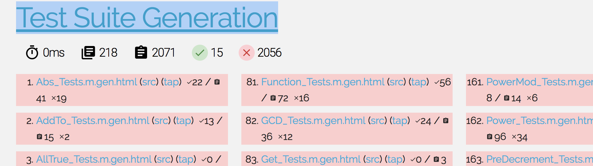
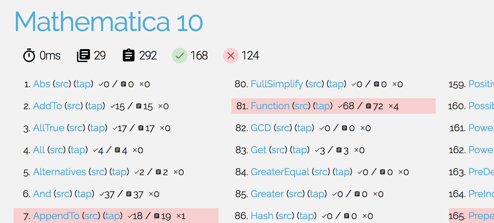

[](https://travis-ci.org/darvin/MMATestSuiteGenerator)

## [Website with automated build results](https://darvin.github.io/MMATestSuiteGenerator/)

## Local Usage

   - Install `parallel` : `apt-get install parallel` or `brew install parallel`
   - Install Node, run `npm install`
   - Add desired `.nb` files from `/Applications/Mathematica.app/Contents/Documentation/English/System/ReferencePages/Symbols/` to `./WHITELIST` ([edit](WHITELIST) it to add stuff in upstream repo)
   - Test that your installation of Mathematica actually works:
      - Local installation: `LOCAL=1 make mathematica-self-tests`
      - Installation on Docker: `make mathematica-self-tests`
   - Generate tests (It's gonna run pretty fast thanks to [GNU Parallel](https://www.gnu.org/software/parallel/)
      - `make generate-compat-tests`
      - `LOCAL=1 make generate-compat-tests`
   - Find generated from docstrings tests in `./output/Tests`.
   - Run tests:
      - `make run-compat-tests`
      - `LOCAL=1 make run-compat-tests`
   - Find [TAP](https://testanything.org/) results in `./output/Results/$YourInterpreterName/*.tap`
      - Checkout compatibility of [Expreduce](https://github.com/corywalker/expreduce) or [mmaclone](https://github.com/jyh1/mmaclone)
   - Generate very pretty website with [Mochawesome](https://github.com/adamgruber/mochawesome):
      - `LOCAL=1 make website`
   - Open website with test reports in browser:
      - `LOCAL=1 make serve-website`
   - ...Or just run the whole thing at once:
      - `make` for Mathematica on Docker
      - `LOCAL=1 make` for natively installed Mathematica

## About test reports



This is report of Test generation. This is Mathematica Documentation `.nb` -> `$NotebookName_Tests.m` generator. As it parses out test cases, it runs them. If test failed, it marks it as failed on generation step, and marks it as “`Skip`” for the test suite - because its clearly broken. Right now there are tons of tests broken like that, I think thats because of my inferior parsing that I gonna fix shortly (it doesn’t respect multiline-multibox examples and there are tons of them, its totally fixable tho)


Then, I’m taking generated (and verified) tests from MMA10 docs and running them against MMA10




Here, all wrong tests suppose to be skipped. And here should be not a single error - those tests are already verified. Like you see there are few errors, because im doing something wrong, and im gonna fix it :)

   
### Example of generated test:


```Mathematica
TapSuite[TapComment["Test if an expression is an integer:"], 
 TapTestSame[MatchQ[12345, _Integer], True], 
 TapComment["Test if an expression is a sum of two or more terms:"], 
 TapTestSame[MatchQ[(x - 1)*(1 + 2*x + 3*x^2), _ + __], False], 
 TapTestSameBROKEN[MatchQ[Expand[x*(1 + 2*x + 3*x^2)], _ + __], True], 
 TapComment["Test if an expression is explicitly zero:"], 
 TapTestSame[MatchQ[1 + 1/GoldenRatio - GoldenRatio, 0], False], 
 TapTestSame[MatchQ[Simplify[1 + 1/GoldenRatio - GoldenRatio], 0], True], 
 TapComment["Match an association:"], 
 TapTestSame[MatchQ[Association[a -> 1, b -> 2], _Association], True], 
 TapComment["Match a rule in an association, using an association as a \
pattern:"], TapTestSame[MatchQ[Association[a -> 1], Association[a -> _]], 
  True], TapTestSame[MatchQ[Association[a -> 1], Association[_ -> 1]], True], 
 TapComment["KeyValuePattern lets you match any element in an association:"], 
 TapTestSame[MatchQ[Association[a -> 1, b -> 2, c -> 3], 
   KeyValuePattern[b -> 2]], True], 
 TapComment["It also works on lists of rules:"], 
 TapTestSame[MatchQ[{a -> 1, b -> 2, c -> 3}, KeyValuePattern[b -> 2]], True], 
 TapComment["Match a rule in an association with a condition:"], 
 TapTestSame[MatchQ[Association[a -> 1], Association[a -> _?OddQ]], True], 
 TapTestSame[MatchQ[Association[a -> "foo"], 
   Association[a -> x_ /; StringQ[x]]], True], 
 TapComment["Match a Rule in an association using Alternatives:"], 
 TapTestSame[MatchQ[Association[a -> 1], Association[_ -> 1 | 2]], True], 
 TapComment["Use Verbatim to match a literal blank:"], 
 TapTestSame[MatchQ[Association[a -> _], Association[a -> Verbatim[_]]], True], 
 TapComment[
  "_ or Blank has special meaning in an association used as a pattern:"], 
 TapTestSame[MatchQ[Association[a -> 1], Association[a -> _]], True], 
 TapComment[
  "Use __ or BlankSequence to match more than one rule in an association:"], 
 TapTestSame[MatchQ[Association[a -> 1, b -> 2], Association[_]], False], 
 TapTestSame[MatchQ[Association[a -> 1, b -> 2], Association[__]], True], 
 TapComment["Match an association containing a given rule and possibly more:"], 
 TapTestSameBROKEN[MatchQ[Association[a -> 1], Association[a -> 1, ___]], 
  True], TapTestSameBROKEN[MatchQ[Association[a -> 1, b -> 2], 
   Association[a -> 1, ___]], True], 
 TapComment["Match an association containing three elements:"], 
 TapTestSame[MatchQ[Association[a -> 1, b -> 2, c -> 3], Association[_, _, _]], 
  True], TapTestSame[MatchQ[Association[a -> 1, b -> 2, c -> 3], 
   a_ /; Length[a] == 3], True], TapComment["Match nested associations:"], 
 TapTestSame[MatchQ[Association[1 -> Association[2 -> x]], 
   Association[_ -> Association[_]]], True]]

```


